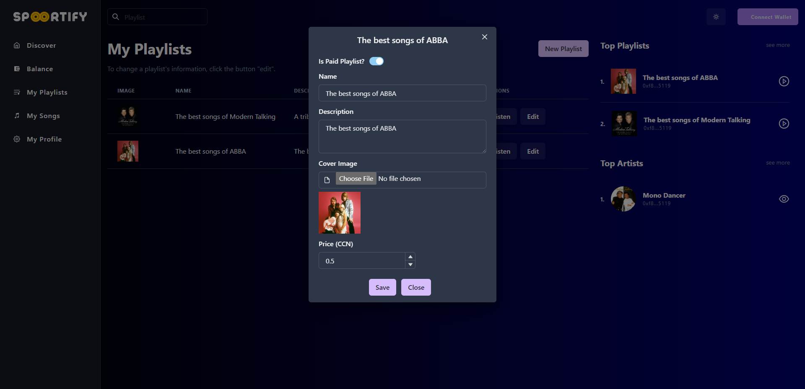
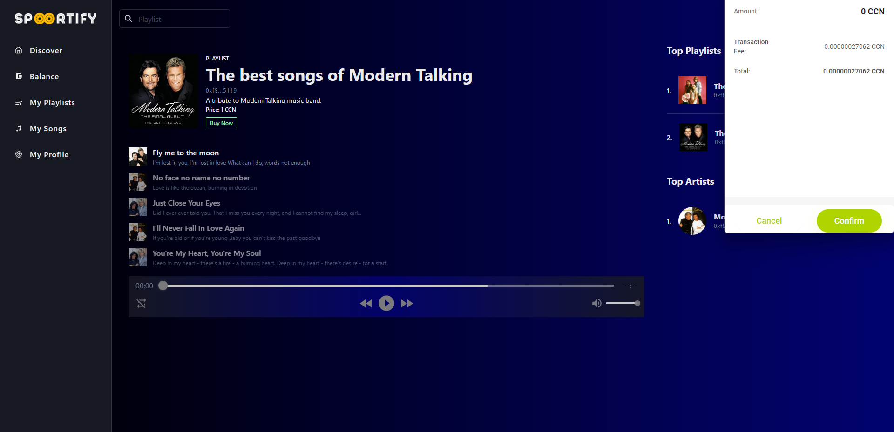
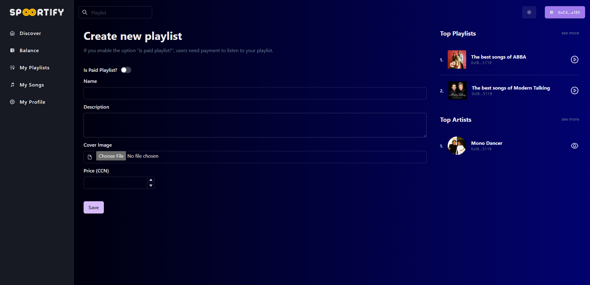
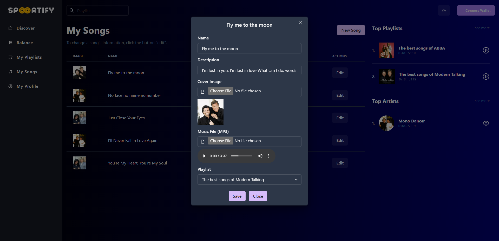
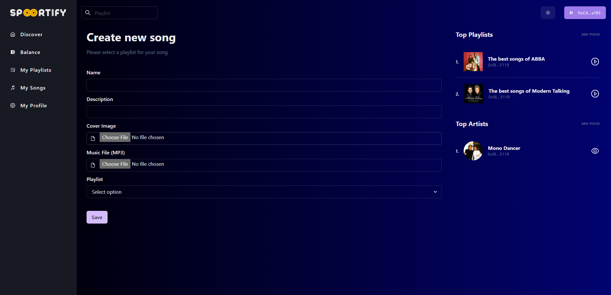
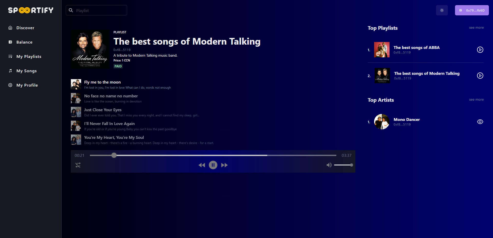
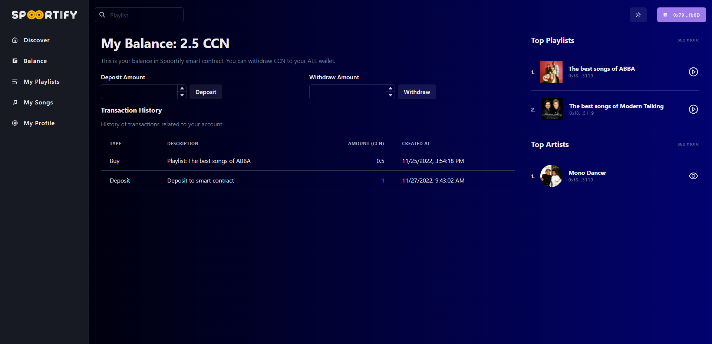

## Introduction
Spoortify allows users to create songs, paid or free playlists, and purchase paid playlists. 

#### Demo: [Spoortify](https://spoortify.a2n.finance)

#### Smart contract address: 0x06b1D06b7faaEA8045788F9910b084Fa2C766a6D
Spoortify smart contract is built on Huygens Devnet.

## Features
Currently, users can buy playlists with token CCN only.

- [x] Deposit
- [x] Withdraw
- [x] See transaction history
- [x] Create paid or free playlist
- [x] Create songs.
- [x] Buy paid playlists.
- [x] View all playlists
- [x] View all artists
- [x] Update artists' profile
- [x] Listen music
- [ ] Share playlists
- [ ] Like songs & playlists
- [ ] Check songs & playlists copyright
- [ ] Support other tokens
- [ ] Support recurring payment model.

## Tech stack
#### Spoortify contains three components:
- Smart contract
- File Storage
- dApp
#### To build the smart contract, we use:
- Huygens Devnet
- Solidity 8.17
- Truffle
- OpenZeppelin library

#### To upload and store files, we use:
- Storj IPFS api.

#### To develop this dApp, we use:
- MCP.js
- EthersJS
- Chakra UI framework
- NextJS & React
- Typescript
- Redux
- H5 Audio Player library.

## Deploy
You can follow these steps to deploy and test this project.
- Create .env file by copying content of .env.example
- Insert DB url and private key into .env file.
- Install libraries: `npm i`
- Deploy smart contract: `truffle migrate --network huygens`
- Copy smart contract address and paste the address to .env file
- Run app: `npm run dev` for dev mode, or `npm run build` and `npm run start` for production mode.

## Screenshots
#### My Playlists

#### Buy a playlist

#### New playlist

#### My Songs

#### New Song

#### Listen to music

#### My balance & Transaction History

